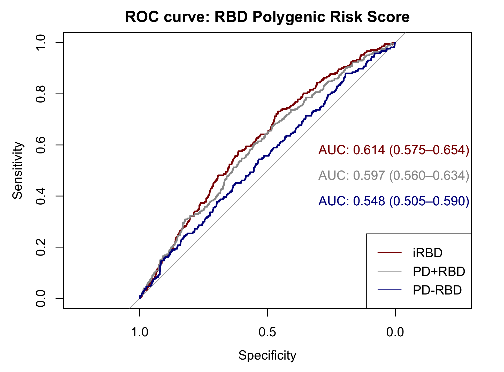

# PRS_comparisons
Using AUC analysis to see how well the polygenic risk profiles of RBD and of various conditions can differentiate between RBD cases and controls.  

Polygenic risk profiles were defined as GWAS significant (and replicated) variants, except for DLB, were the p-value threshold was determined by permutation by Scholz et. al., and RBD, where the FDR threshold was applied. Risk scores were calulcated in an idiopathic RBD cohort (cases=1037, controls=909) using plink.  

Genetic profiles to test were determined based on previous associations to PD and/or genetic correlation with RBD. 

## Testing RBD PRS performance in RBD
```R
require(data.table)
require(pROC)

RBD_FDR <- fread("rbd_meta_fdr_adjusted.profile", header = T)
RBD_FDR <- subset(RBD_FDR, PHENO != -9)
RBD_FDR$PHENOT <-ifelse(RBD_FDR$PHENO==1, "CONTROL", ifelse(RBD_FDR$PHENO==2,"RBD", NA))

rocAuc <- roc(RBD_FDR$PHENO, RBD_FDR$SCORE)
auc(rocAuc) # 0.662
ci(rocAuc, of="auc") # 0.637-0.685 (DeLong)
coords(rocAuc, "best") # threshold: 0.00266 # specificity: 0.60 # sensitivity: 0.66
thresh <- coords(rocAuc, "best")[1]
```

## Comparing RBD PRS in PD +/- RBD

```R
PDwRBD_RBD = fread("PDwRBD_rbd-fdr.profile", header = T)
PDnoRBD_RBD = fread("PDnoRBD_rbd-fdr.profile", header = T)

PDwRBD_RBD = subset(PDwRBD_RBD, PHENO != -9)
PDnoRBD_RBD = subset(PDnoRBD_RBD, PHENO != -9)

# PD+RBD
rocAuc <- roc(PDwRBD$PHENO, PDwRBD$SCORE)
auc(rocAuc) # 0.5969
ci(rocAuc, of="auc") # 95% CI: 0.5597-0.6341 (DeLong)
coords(rocAuc, "best") # threshold: 0.0008 # specificity 0.55 # sensitivity: 0.60

# PD-RBD
rocAuc <- roc(PDnoRBD$PHENO, PDnoRBD$SCORE)
auc(rocAuc) # 0.5475
ci(rocAuc, of="auc") # 95% CI: 0.5048-0.5903 (DeLong)
coords(rocAuc, "best") # threshold: 0.0004375 # specificity: 0.53 # sensitivity: 0.54
```

## Making ROC curve
```R
png("ROC-compare_RBD-FDR_PRS.png", width = 6.5, height = 4.8, units = "in", res = 300)

rocobj <- plot.roc(RBD_FDR$PHENOT, RBD_FDR$SCORE,  main="ROC curve: RBD Polygenic Risk Score",
                   percent=FALSE,  ci=TRUE, print.auc=TRUE, print.auc.x = .3, print.auc.y = .6, col = "darkred")

rocobj <- plot.roc(PDwRBD$PHENO, PDwRBD$SCORE,  main="ROC curve: PD +/- RBD vs controls: RBD Profile",
                   percent=FALSE,  ci=TRUE, print.auc=TRUE, print.auc.x = .3, print.auc.y = .5, col = "#999999", add = TRUE)

rocobj <- plot.roc(PDnoRBD$PHENO, PDnoRBD$SCORE,
                   percent=FALSE,  ci=TRUE, print.auc=TRUE, col = "darkblue", print.auc.x = .3, print.auc.y = .4, add = TRUE)

legend("bottomright", 
       legend = c("iRBD", "PD+RBD", "PD-RBD"), 
       col = c("darkred", "#999999", "darkblue"),
       lty = c(1, 1, 1),
       lwd = c(1, 1, 1))

dev.off()
```


### Quartile analysis
```R
RBD_FDR <- subset(RBD_FDR, PHENO != -9)

RBD_FDR$quartile <- with(RBD_FDR, cut(SCORE, 
                                breaks=quantile(SCORE, probs=seq(0,1, by=0.25), na.rm=TRUE), 
                                include.lowest=TRUE, labels = 1:4))

RBD_FDR$decile <- with(RBD_FDR, cut(SCORE, 
                                      breaks=quantile(SCORE, probs=seq(0,1, by=0.10), na.rm=TRUE), 
                                      include.lowest=TRUE, labels = 1:10))

head(RBD_FDR)
RBD_FDR$PHENO_BI = RBD_FDR$PHENO-1

require(broom)

fit_quar <- glm(RBD_FDR$PHENO_BI ~ as.factor(RBD_FDR$quartile), family = "binomial")
tidy_fitq = tidy(fit_quar)
tidy_fitq$estimate
tidy_fitq$quartile = c(NA,2,3,4)
tidy_fitq = tidy_fitq[2:4,]
tidy_fitq$beta.UB = tidy_fitq$estimate+1.96*tidy_fitq$std.error
tidy_fitq$beta.LB = tidy_fitq$estimate-1.96*tidy_fitq$std.error
tidy_fitq$pheno = "iRBD"


# PD + RBD

PDwRBD = fread("PDwRBD_rbd-fdr.profile", header = T)
PDwRBD = subset(PDwRBD, PHENO != -9)
PDwRBD$quartile <- with(PDwRBD, cut(SCORE, 
                                      breaks=quantile(SCORE, probs=seq(0,1, by=0.25), na.rm=TRUE), 
                                      include.lowest=TRUE, labels = 1:4))

PDwRBD$PHENO_BI = PDwRBD$PHENO-1

fit_quar2 <- glm(PDwRBD$PHENO_BI ~ as.factor(PDwRBD$quartile), family = "binomial")
tfq2 = tidy(fit_quar2)
tfq2$quartile = c(NA,2,3,4)
tfq2 = tfq2[2:4,]
tfq2$beta.UB = tfq2$estimate+1.96*tfq2$std.error
tfq2$beta.LB = tfq2$estimate-1.96*tfq2$std.error
tfq2$pheno = "PD+RBD"


# PD - RBD
PDnoRBD = fread("PDnoRBD_rbd-fdr.profile", header = T)

PDnoRBD = subset(PDnoRBD, PHENO != -9)
PDnoRBD$quartile <- with(PDnoRBD, cut(SCORE, 
                                    breaks=quantile(SCORE, probs=seq(0,1, by=0.25), na.rm=TRUE), 
                                    include.lowest=TRUE, labels = 1:4))

PDnoRBD$PHENO_BI = PDnoRBD$PHENO-1

fit_quar3 <- glm(PDnoRBD$PHENO_BI ~ as.factor(PDnoRBD$quartile), family = "binomial")
tfq3 = tidy(fit_quar3)
tfq3$quartile = c(NA,2,3,4)
tfq3 = tfq3[2:4,]
tfq3$beta.UB = tfq3$estimate+1.96*tfq3$std.error
tfq3$beta.LB = tfq3$estimate-1.96*tfq3$std.error
tfq3$pheno = "PD-RBD"

rbd_quartile_fit = rbind(tidy_fitq, tfq2, tfq3)
rbd_quartile_fit$Phenotype = factor(rbd_quartile_fit$pheno, levels = c("iRBD", "PD+RBD", "PD-RBD"))
rbd_quartile_fit$OR = exp(rbd_quartile_fit$estimate)
rbd_quartile_fit$OR.UB = exp(rbd_quartile_fit$beta.UB)
rbd_quartile_fit$OR.LB = exp(rbd_quartile_fit$beta.LB)

png("RBD-FDR_PRS_Quartiles.png", width = 5.5, height = 4, units = "in", res = 300)

x = ggplot(rbd_quartile_fit, aes(x=as.factor(quartile), y=exp(estimate), group=Phenotype, color=Phenotype)) + 
  geom_point(size=3, position = position_dodge(0.2)) + 
  geom_errorbar(aes(ymin=(exp(rbd_quartile_fit$beta.LB))), 
                ymax=(exp(rbd_quartile_fit$beta.UB)), width=0.1, 
                position=position_dodge(0.2)) 

 
x + labs(title = "Risk for disease by RBD PRS Quartile", x="RBD PRS Quartile", y="Odds ratio & 95% CI") +
  theme_bw() + scale_color_manual(values=c('red4', '#999999', 'darkblue')) + ylim(0.8,5.5) + 
  theme(plot.title = element_text(hjust = 0.5, face = "bold"))

dev.off()
````


## Analyzing PRS effects on RBD age at onset and rate of conversion
#### Linear regression:
```R
data = read.csv("CONVERSION/RBD_conversion_Nov2020.csv", header = T)

data$prs_quartile <- with(data, cut(RBD_PRS, 
                                      breaks=quantile(RBD_PRS, probs=seq(0,1, by=0.25), na.rm=TRUE), 
                                      include.lowest=TRUE, labels = 1:4))
                                      
dao = subset(data, prs_quartile != "NA")
dao = subset(dao, AAO_RBD != "NA")

x=as.numeric(dao$RBD_PRS)
length(x)
y=as.numeric(dao$AAO_RBD)
length(y)

dao_fit = glm(y ~ x)
summary(dao_fit) # estimate=38.0, se=54.62, p=0.49

aao_cor = ggplot(dao, aes(x, y)) + geom_point() + geom_smooth(method = "lm",
                                                           formula = y ~ x)
aao_cor = aao_cor + xlab("RBD polygenic risk score") + ylab("Age at Onset RBD") 
ggsave(aao_cor, file="scatter_AAO-RBD.jpeg")

```
### Kaplan-Meier Survival:
```R
data$event = ifelse(data$Neurodegeneration == "N", 1, 2)

da = subset(data, prs_quartile != "NA")
da = subset(da, AAO_Time_to_Conversion != "NA")
converted = subset(da, event == 2)

surv_object <- Surv(time = as.numeric(da$AAO_Time_to_Conversion), event = da$event)
km_fit <- survfit(surv_object ~ da$prs_quartile, data = da)
da = subset(da, AAO_Time_to_Conversion <= 25)

palette = c("burlywood2", "brown3", "darkred", "black")

png("KMSurv_AAO_cutOff25years.png", width = 5.5, height = 4, units = "in", res = 300)
km <- ggsurvplot(km_fit, data = da, censor.shape="*", censor.size = 5, risk.table=F, 
                  ncensor.plot=F, pval=TRUE, palette = palette,
                 legend.labs=c("Quartile 1", "2", "3", "4"), xlab="Time to Conversion (Years)",
                 ggtheme=theme_classic())
km <- km + ggtitle("Time to Conversion to Synucleinopathy (AAO)")

dev.off()
```
